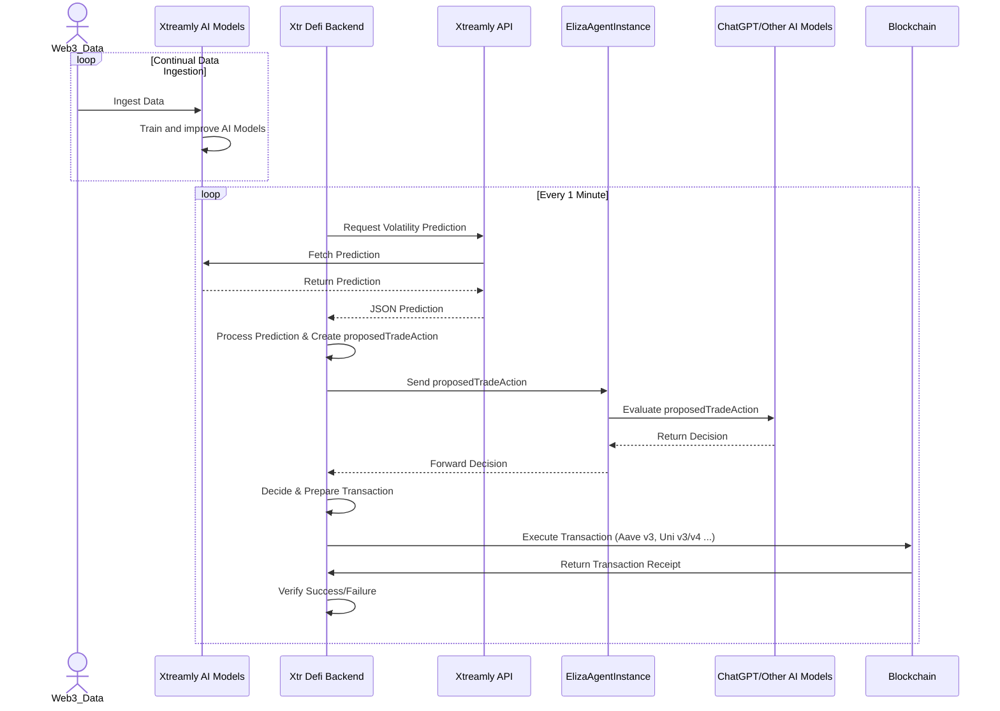
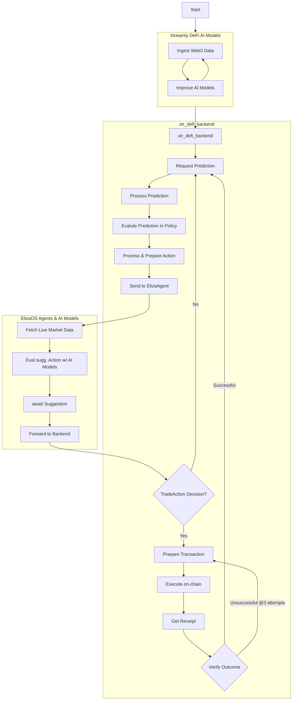

# Xtreamly Aave Loop Leverage Agent Demo
>This Repo is WIP 

## TLDR
This project leverages an automated trading system that integrates data ingestion from Web3 sources into Xtreamly AI Models for continual training and improvement. Every minute, the Xtr Defi Backend requests volatility predictions from the Xtreamly API, which are generated by the AI models. The backend processes these predictions to formulate a proposed trade action, which is then evaluated by the ElizaAgentInstance using ChatGPT/Other AI Models and real-time market data. Depending on the decision, a transaction may be prepared and executed on the blockchain. The entire process is designed to iterate seamlessly, with fail-safes for transaction verification ensuring reliability and accuracy.








----

## Quick Start (WIP)

Prerequiremnts: 

- Node v18.18, v23.3
- nvm 
- pnpm 
- yarn (optional)
- Typescript


1) Clone the Repo
```bash
git clone git@github.com:Xtreamly-Team/looptrader_agent_DEMO.git

cd looptrader_agent_DEMO
```

2)
```bash 
cd xtr_defi_backend
```

3) Setup the xtr_defi_backend

```bash 
nvm use

cp .env.example .env

# Fill .env 
PRIVATE_KEY=0x56...
ARBITRUM_RPC_MAINNET_RPC=...
ARBITRUM_SEPOLIA_RPC=...

pnpm install

pnpm dev
```

4)

Wait until the express server boots and starts logging the api volatitlity response from the xtr_AI models

5) Install the xtr_trader dependency for customizing your trading logic

```bash

pnpm add git+ssh://git@github.com:Xtreamly-Team/xtreamly-trader

# Define and extend src/scripts/xtrTraderPolicy.ts with xtreamly-trader package. 

```

6) Setup 

```bash

cd loopTraderAgent

git checkout $(git describe --tags --abbrev=0)

nvm use

pnpm install 

pnpm install --include=optional sharp

cp .env.example .env

# Enter your OpenAI API Key in .env
OPENAI_API_KEY=sk.....

```

7) Download and add `loopTraderAgent.json` to /characters

8) 

```bash

pnpm build

pnpm run dev --characters="characters/loopTraderAgent.json"

```

9) Go to the Terminal with `pnpm dev`running in `xtr_defi_backend``
There you can see: 

- Incoming predictions
- Agent responses on the predictions
- on-chain execution & txn receipts

